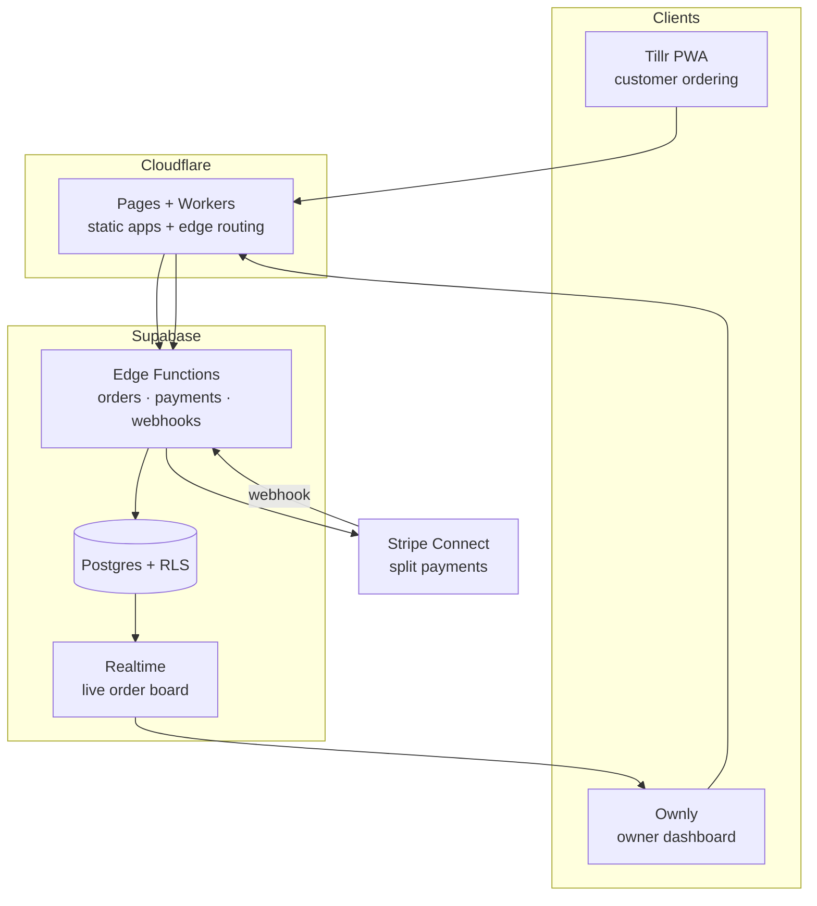

# Lucky Cat — a multi-tenant restaurant SaaS (case study)

> Source is private (it's a live commercial product). This is the story of how it's
> built: the problem, the architecture, and the decisions. Screenshots and a system
> diagram, no product code.

**Lucky Cat** is a multi-tenant SaaS I designed and built solo. It runs a real
restaurant in Limerick, Ireland — live orders, live card payments, daily staff use —
as two connected apps on one backend:

- **Ownly** — the owner/manager app: shifts and payroll, stock with auto-deduction, a cash-up flow, and a live orders board.
- **Tillr** — the customer ordering PWA: menu, cart, checkout, and real-time order tracking.

From first commit to a paying restaurant in production: **under two months**, one person.

## The problem

Small restaurants get squeezed between clunky, expensive POS suites and a pile of
disconnected tools (a separate ordering site, a spreadsheet for stock, another for
rota, a card terminal that doesn't talk to any of them). I wanted one system where a
customer's order deducts stock, feeds the owner's live board, and settles a real
split payment — without the owner touching four dashboards.

## Architecture

**One database, many tenants.** Every row carries a `store_id`; Postgres
**Row-Level Security** enforces isolation in the database itself, so a bug in the app
layer can't leak one restaurant's data to another. The same schema serves the live
store, a pristine demo store, and any future tenant, selected by an environment
variable per deployment.

**Payments that actually settle.** Stripe **Connect** takes the customer's card and
routes a platform fee to Lucky Cat and the rest to the restaurant, reconciled by
signed webhooks — not a "payments" screenshot, real money moving.

**Edge-first.** The apps are static builds on **Cloudflare Pages**; all logic lives in
**Supabase Edge Functions** and Postgres, so there's no server to babysit and the
cold-start cost is near zero.

## Screenshots

| Ownly — owner dashboard | Tillr — customer ordering |
|---|---|
|  |  |

## Some decisions I'd defend in an interview

- **RLS as the security boundary, not the app.** Multi-tenant leaks are almost always an app-layer `where` clause someone forgot. Pushing isolation into Postgres RLS means the default is deny; the app can't accidentally over-share.
- **A demo store seeded from the same schema.** The public demo is a real tenant with throwaway data, reset nightly by a cron. Prospects see the actual product, never a mockup, and never a real customer's orders.
- **Security hardening done as its own pass.** A pentest-style review tightened the Content-Security-Policy to enforce mode (validated with zero violations across every surface) and locked anonymous access out of owner-only tables.

## Stack

`Supabase (Postgres · RLS · Edge Functions · Realtime)` · `Cloudflare Pages` · `Stripe Connect` · `TypeScript / React` · `PWA`

## Try the live demo

- Ownly (owner app): https://lucky-cat.pages.dev/template/ownly/
- Tillr (ordering app): https://lucky-cat.pages.dev/template/tillr/

More work: [augustobastos.pages.dev](https://augustobastos.pages.dev)
