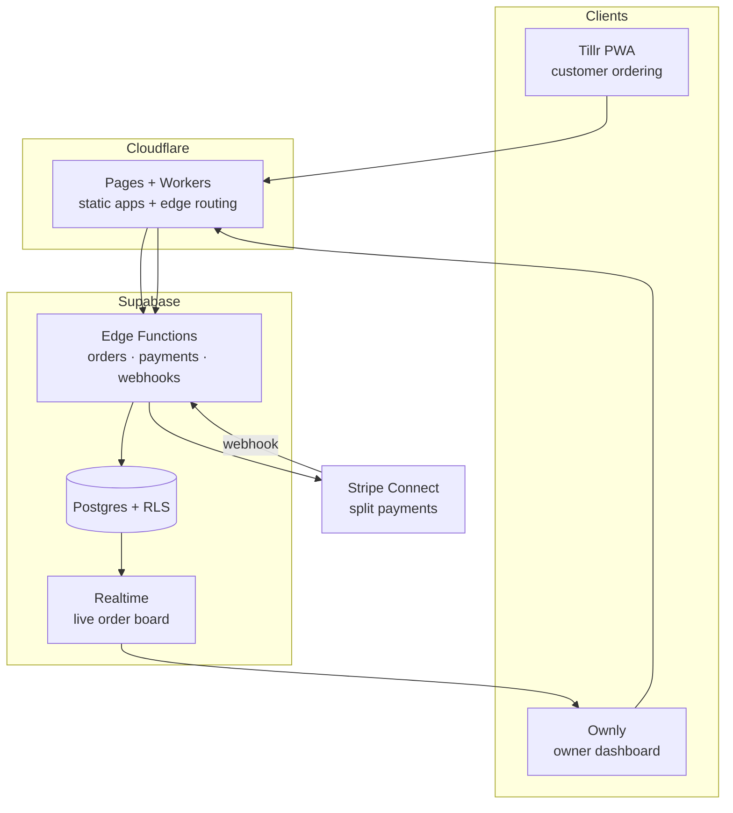
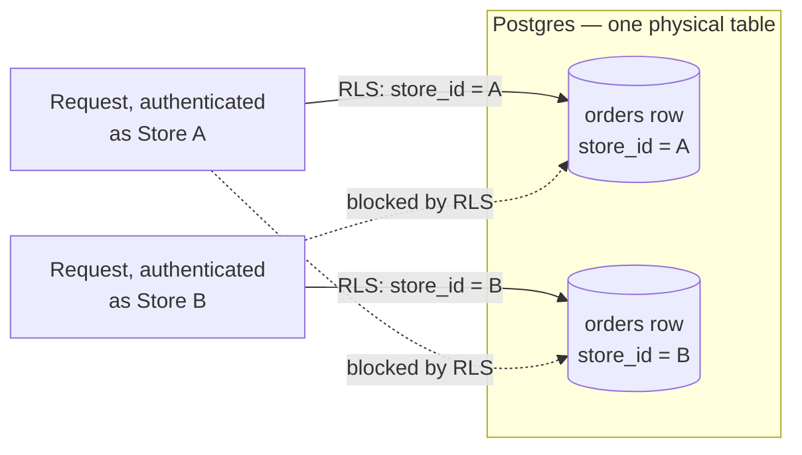
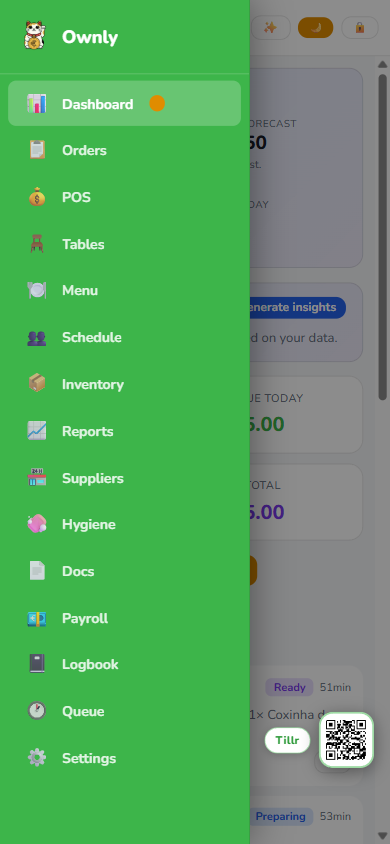
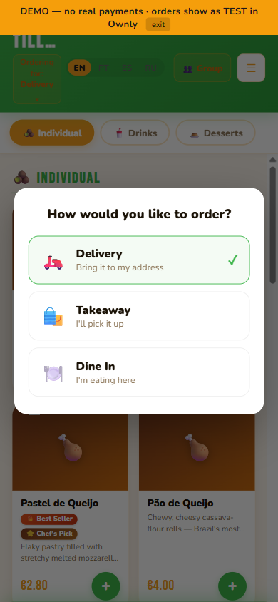

# Lucky Cat — Multi-Tenant Restaurant SaaS, Built Solo (Case Study)

**Row-Level Security as the tenant boundary · Stripe Connect for split payments · Postgres + Edge Functions, no server to babysit.**

> Source is private, because it is a commercial product. This is the story of how it
> is built: the problem, the architecture, and the decisions. Screenshots and a system
> diagram, no product code.

**Lucky Cat** is a multi-tenant SaaS I designed and built solo, as two connected apps
on one backend:

- **Ownly** — the owner/manager app: shifts and payroll, stock with auto-deduction, a cash-up flow, and a live orders board.
- **Tillr** — the customer ordering PWA: menu, cart, checkout, and real-time order tracking.

First version built solo, front to back, in **under two months** (June–July 2026). It has
been under active development since.

> **Where it actually stands.** No paying customer has ever used it: zero orders, zero
> revenue, no live client. One restaurant in Limerick set a store up and tested it; it
> never went into operation, and that account is frozen. Stripe **is** in live mode and
> the card rail has been exercised end to end with a real €1 payment of my own, but
> that is infrastructure proven, not a customer. Everything below — the architecture,
> the security review, the migration drift — is real work on a real system; what it is
> not is a deployment somebody pays for.

## 🍽️ The problem

Small restaurants get squeezed between clunky, expensive POS suites and a pile of
disconnected tools (a separate ordering site, a spreadsheet for stock, another for
rota, a card terminal that doesn't talk to any of them). I wanted one system where a
customer's order deducts stock, feeds the owner's live board, and settles a real
split payment — without the owner touching four dashboards.

## 🏗️ Architecture

**One database, many tenants.** Every row carries a `store_id`; Postgres
**Row-Level Security** enforces isolation in the database itself, so a bug in the app
layer can't leak one restaurant's data to another. The same schema serves the live
store, a pristine demo store, and any future tenant, selected by an environment
variable per deployment.

**Payments that actually settle.** Stripe **Connect** takes the customer's card and
routes a platform fee to Lucky Cat and the rest to the restaurant, reconciled by
signed webhooks — not a "payments" screenshot, real money moving.

**Edge-first.** The apps are static builds on **Cloudflare Pages**; all logic lives in
**Supabase Edge Functions** and Postgres, so there's no server to babysit and the
cold-start cost is near zero.

### Tenant isolation, illustrated

*Same table, same schema, every tenant — Postgres itself refuses a cross-tenant read
or write, so an app-layer bug can't leak one store's rows into another's.*

## 📸 Screenshots

| Ownly — owner dashboard | Tillr — customer ordering |
|---|---|
|  |  |

## 🧠 Some decisions I'd defend in an interview

- **RLS as the security boundary, not the app.** Multi-tenant leaks are almost always an app-layer `where` clause someone forgot. Pushing isolation into Postgres RLS means the default is deny; the app can't accidentally over-share.
- **A demo store seeded from the same schema.** The public demo is a real tenant with throwaway data, reset nightly by a cron. Prospects see the actual product, never a mockup, and never a real customer's orders.
- **Security hardening done as its own pass.** A pentest-style review tightened the Content-Security-Policy to enforce mode (validated with zero violations across every surface) and locked anonymous access out of owner-only tables.

## 🔒 What a security audit found — and fixed

A security review I ran against the deployed system — adversarial testing against the actual database grants and API behaviour, not just a code read-through — turned up real bugs. Two worth naming, both fixed the same day:

- **An unauthenticated RPC could rewrite another store's inventory.** A stock-adjustment function was meant to run only as an internal database trigger, but Postgres's default grants left it directly callable over the REST API with no ownership check — any logged-in session (including Tillr's anonymous-checkout flow, which still carries an authenticated role) could call it against *any* store's ID — a competitor's, not just their own. The fix: revoke direct execute access; the trigger doesn't need that grant to keep firing.
- **A client-writable `billing_plan` column let a store self-select a cheaper Stripe price.** Row-level security correctly limited writes to a store's own row, but nothing restricted *which* columns — an owner could patch their own `billing_plan` directly, and checkout trusted it at face value. The fix: revoke the blanket write grant, re-grant `UPDATE` on only the columns a store legitimately edits (loyalty settings), pull billing and Stripe fields out of client reach entirely.

The same pass also caught a process bug, not just a code bug: some earlier fixes had been applied straight to the database and never landed in a committed migration, so the schema in git no longer matched what was actually deployed. Part of the fix there was mechanical; part of it was going back and writing the migrations for changes that had only ever existed in the database, so the repo tells the truth about what is running again.

## 🧰 Stack

| Layer | Technology |
|---|---|
| Database | Postgres + Row-Level Security |
| Backend | Supabase Edge Functions, Realtime |
| Payments | Stripe Connect |
| Frontend | TypeScript / React, PWA |
| Hosting | Cloudflare Pages |

## 🚀 Try the live demo

| App | Link |
|---|---|
| Ownly (owner app) | https://lucky-cat.pages.dev/template/ownly/ |
| Tillr (ordering app) | https://lucky-cat.pages.dev/template/tillr/ |

More work: [augustobastos.pages.dev](https://augustobastos.pages.dev)
